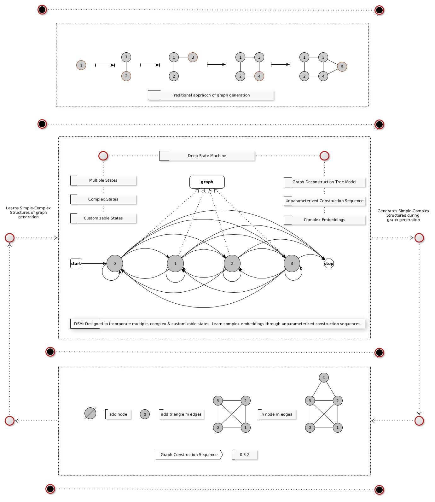

# Deep-State-Machine: Generative Model for Graph Generation
	- Deep Auto-Regressive Machines for Graph Construction

- DGMG, DeepGG, GraphRNN
 	- Basic two states, [add node, add edge]
 	- Simple and non-customizable states
 	- Traversal algorithm: bfs, dfs,... for construction sequence generation
 	- Parameterized construction sequencess
 	- Learning embeddings of either node or edge in a single state

 
- Deep State Machine (DSM): Envisioned a novel appraoch for learning and generating graphs.
	- Multiple states
	- Complex states
	- Customizable states
	- Graph Deconstruction Tree Model (GDTM) for construction sequence generation
	- GDTM: A non-deterministic approach for traversing graph
	- Unparameterized construction sequences
	- Learning complex embeddings in single state
	- Learn and generate complex structures of graph in single state
	- Graph generation in fewer steps
	- DSM combined with GDTM to learn various alternative paths of graph generation

# Graph Deconstruction Tree Model: 

